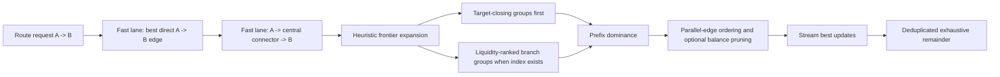
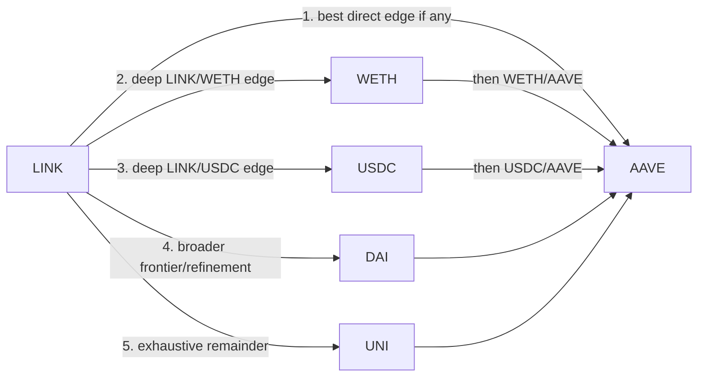
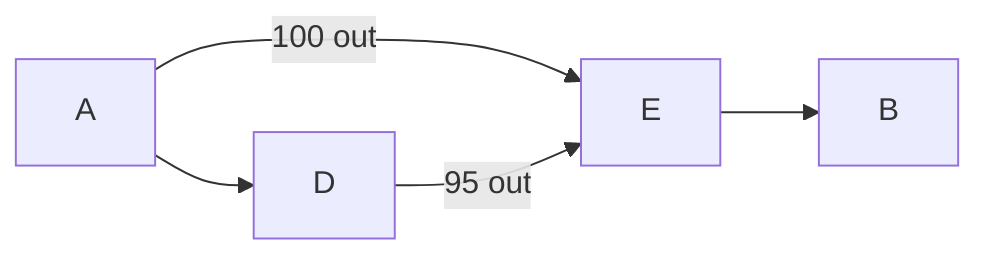

# evm-amm-search

Graph-based route and cycle search over [`evm-amm-state`](../evm-amm-state)
registries.

The crate is designed for warmed-cache routing where the first actionable quote
can be streamed in microseconds to low milliseconds, while the exhaustive
remainder continues in the background and can still replace the incumbent if it
finds a better route.

`evm-amm-state` owns protocol adapters, discovery, cold-start, cache
synchronization, and exact pool quoting. This crate adds the search layer:

1. Use `evm-amm-state` to discover or manually register pools.
2. Cold-start those pools into one shared `EvmCache`.
3. Register the ready pools in `AdapterRegistry`.
4. Build an `AmmGraph` from the registry.
5. Use `AmmSearcher` to find best A-to-B routes or bounded cycles.

The graph follows the same high-level shape as Fynd: token addresses are nodes
and directed AMM swap opportunities are edges. Multi-token pools are fully
connected with directed edges between every distinct token pair, and parallel
pools on the same pair remain separate edges.

## Example

```rust,no_run
use alloy_primitives::{address, U256};
use evm_amm_search::{AmmGraph, AmmSearcher, GraphBuildOptions, RouteRequest};
use evm_amm_state::adapters::{AdapterRegistry, SimConfig};
# use evm_amm_state::adapters::AdapterCache;
#
# fn example(registry: &AdapterRegistry, cache: &mut dyn AdapterCache) -> Result<(), Box<dyn std::error::Error>> {

let report = AmmGraph::from_registry(registry, GraphBuildOptions::default());
let searcher = AmmSearcher::new(registry, &report.graph);

let usdc = address!("A0b86991c6218b36c1d19D4a2e9Eb0cE3606eB48");
let weth = address!("C02aaA39b223FE8D0A0e5C4F27eAD9083C756Cc2");

let request = RouteRequest::new(usdc, weth, U256::from(1_000_000_u64))
    .with_sim_config(SimConfig::default());
let best = searcher.find_best_route(&request, cache)?;

println!("{} hops, output={}", best.path.len(), best.amount_out);
# Ok(())
# }
```

For production-style fan-out over a concrete `EvmCache`, use the overlay-backed
parallel API. It creates isolated `EvmOverlay` instances for worker threads, so
candidate quotes do not mutate the shared warmed cache:

```rust,no_run
use evm_amm_search::{ParallelSearchConfig, RouteRequest};
# use evm_amm_search::AmmSearcher;
# use evm_fork_cache::cache::EvmCache;
# use alloy_primitives::U256;
#
# fn example(searcher: &AmmSearcher<'_>, cache: &mut EvmCache) -> Result<(), Box<dyn std::error::Error>> {
# let usdc = alloy_primitives::Address::ZERO;
# let weth = alloy_primitives::Address::repeat_byte(1);
let request = RouteRequest::new(usdc, weth, U256::from(1_000_000_u64));
let routes = searcher.find_routes_parallel(
    &request,
    cache,
    ParallelSearchConfig::default().with_workers(8),
)?;
# let _ = routes;
# Ok(())
# }
```

When you have many independent route requests, prefer
`find_routes_batch_parallel` so worker threads and overlays are created once for
the whole batch rather than once per request.

For latency-sensitive clients, use `stream_routes_parallel`. Streaming always
starts with heuristic-first evaluation and emits best updates as soon as viable
quotes are found. The caller chooses whether to stop after the heuristic phase
or continue with a deduplicated exhaustive remainder:

```rust,no_run
use alloy_primitives::U256;
use evm_amm_search::{
    RouteRequest, RouteSearchEvent, SearchControl, StreamingSearchConfig,
};
# use evm_amm_search::AmmSearcher;
# use evm_fork_cache::cache::EvmCache;
#
# fn example(searcher: &AmmSearcher<'_>, cache: &mut EvmCache) -> Result<(), Box<dyn std::error::Error>> {
# let token_in = alloy_primitives::Address::ZERO;
# let token_out = alloy_primitives::Address::repeat_byte(1);

let request = RouteRequest::new(token_in, token_out, U256::from(1_000_000_u64));
let report = searcher.stream_routes_parallel(
    &request,
    cache,
    StreamingSearchConfig::default().with_top_k(3),
    |event| {
        if let RouteSearchEvent::BestUpdated { quote, phase, .. } = event {
            println!("new best from {phase:?}: {}", quote.amount_out);
        }
        SearchControl::Continue
    },
)?;

if report.heuristic_was_final_best == Some(false) {
    println!("exhaustive search improved on the heuristic result");
}
# let _ = report;
# Ok(())
# }
```

`StreamingSearchConfig::heuristic_only()` stops once the heuristic list is
exhausted. The default continues to exhaustive completion and reuses the same
per-hop quote cache, so heuristic paths are not simulated again during the
exhaustive remainder.

Streaming also emits `RouteSearchEvent::Progress` snapshots with candidate
counts, failed candidates, duplicate skips, known exhaustive fraction, current
best amount, and a heuristic `confidence_bps` score. The score is scoped to the
configured search universe and is a UX signal, not a statistical guarantee.

Use a stop policy when the caller wants the search itself to terminate once a
threshold is reached:

```rust,no_run
use alloy_primitives::U256;
use evm_amm_search::{
    RouteRequest, SearchControl, SearchFinality, StreamingSearchConfig,
};
# use evm_amm_search::AmmSearcher;
# use evm_fork_cache::cache::EvmCache;
#
# fn example(searcher: &AmmSearcher<'_>, cache: &mut EvmCache) -> Result<(), Box<dyn std::error::Error>> {
# let token_in = alloy_primitives::Address::ZERO;
# let token_out = alloy_primitives::Address::repeat_byte(1);

let request = RouteRequest::new(token_in, token_out, U256::from(1_000_000_u64));
let report = searcher.stream_routes_parallel(
    &request,
    cache,
    StreamingSearchConfig::default().stop_at_confidence_bps(9_000),
    |_| SearchControl::Continue,
)?;

assert_eq!(report.finality, SearchFinality::StopPolicySatisfied);
# Ok(())
# }
```

Use an initial result gate when the caller wants to suppress quote-bearing
events until a threshold is reached, then keep searching exhaustively and stream
later improvements:

```rust,no_run
use alloy_primitives::U256;
use evm_amm_search::{
    RouteRequest, RouteSearchEvent, SearchControl, StreamingSearchConfig,
};
# use evm_amm_search::AmmSearcher;
# use evm_fork_cache::cache::EvmCache;
#
# fn example(searcher: &AmmSearcher<'_>, cache: &mut EvmCache) -> Result<(), Box<dyn std::error::Error>> {
# let token_in = alloy_primitives::Address::ZERO;
# let token_out = alloy_primitives::Address::repeat_byte(1);

let request = RouteRequest::new(token_in, token_out, U256::from(1_000_000_u64));
let report = searcher.stream_routes_parallel(
    &request,
    cache,
    StreamingSearchConfig::default().emit_initial_results_at_confidence_bps(9_000),
    |event| {
        match event {
            RouteSearchEvent::Progress { progress } => {
                println!("confidence={}bps", progress.confidence_bps);
            }
            RouteSearchEvent::InitialResultsReady { best, .. } => {
                println!("first gated quote: {}", best.amount_out);
            }
            RouteSearchEvent::BestUpdated { quote, .. } => {
                println!("later improvement: {}", quote.amount_out);
            }
            _ => {}
        }
        SearchControl::Continue
    },
)?;

assert!(report.initial_results_released);
# Ok(())
# }
```

## Benchmarks And Search Methodology

For transport-level cold-start profiling, provider payload ceilings, and the
current HTTP/WebSocket call breakdown, see
[`docs/network-cold-start-benchmark.md`](docs/network-cold-start-benchmark.md).

The deterministic graph lifecycle baseline requires no provider:

```text
cargo bench --bench graph_lifecycle
```

It compares full construction/rebuild and the current add/remove paths at 16,
64, and 320 pools. The live benchmark below covers cold start and route search.

The focused README benchmark is intentionally small and repeatable. It discovers
Uniswap V2/V3 pools for eight mainnet tokens (`WETH`, `USDC`, `USDT`, `DAI`,
`WBTC`, `LINK`, `UNI`, `AAVE`), cold-starts every ready pool with
`ColdStartPolicy::Eager`, builds a 234-edge graph, bulk-refreshes the optional
liquidity index, then runs 30 warm-cache streaming searches for:

```text
10 WETH -> USDC
100 LINK -> AAVE
1000 DAI -> UNI
```

Run it locally with:

```text
E2E_RPC_URL=<mainnet-url> cargo run --release --example docs_route_benchmark
```

Useful knobs:

```text
DOCS_BENCH_RUNS=30
DOCS_BENCH_BLOCK=<pinned-mainnet-block>
DOCS_BENCH_MAX_HOPS=3
DOCS_BENCH_WORKERS=0              # 0 means available parallelism
DOCS_BENCH_PERSIST_CACHE=1
DOCS_BENCH_CACHE_DIR=.cache/docs-route-benchmark
```

Latest focused run: July 9, 2026, pinned Ethereum block `25494413`, paid RPC
through `LoadBalancedTransport` + batching + gzip, release build, 10 workers.
The graph had `117` indexed pools, `8` token nodes, and `234` directed AMM
edges.

### Cache Setup

| Step | First run |
| --- | ---: |
| Cache build | `86.2ms` |
| Factory discovery | `124.4ms` |
| `cold_start_many` without liquidity index | `1.479s` |
| Graph build | `1.36ms` |
| Liquidity refresh | `234` storage reads, `2.140s` |
| Cold start plus liquidity refresh | `3.619s` |

The benchmark flushes the warmed `EvmCache` to `.cache/docs-route-benchmark`.
On a pinned rerun at the same block, cache build was `235.4ms`, factory
discovery was `131.4ms`, `cold_start_many` was `1.192s`, and the same liquidity
refresh dropped to `163.0ms`. The persisted cache is useful for repeatable local
benchmarks, but live systems should still treat event ingestion as the source of
freshness.

### Warm Streaming Results

The recommended balanced heuristic with a fresh liquidity index streams strong
quotes first and still runs the exhaustive remainder. `first gap` is the output
difference between the first streamed quote and the final exhaustive winner.
`first-vs-best divergence` counts runs where the first streamed quote was not
the final exhaustive winner.

| Route | Sim winner | First quote p50 / p95 / worst | Time to final winner p50 / p95 / worst | Heuristic done p50 / p95 / worst | Exhaustive done p50 / p95 / worst | First gap / first-vs-best divergence |
| --- | --- | ---: | ---: | ---: | ---: | ---: |
| `10 WETH -> USDC` | on | `0.284ms / 0.323ms / 0.339ms` | `0.284ms / 0.323ms / 0.339ms` | `4.09ms / 4.27ms / 4.38ms` | `96.5ms / 99.8ms / 116.6ms` | `0 bps`; first quote was the final winner in `30/30` runs |
| `100 LINK -> AAVE` | on | `0.387ms / 0.461ms / 0.471ms` | `1.59ms / 1.89ms / 3.07ms` | `8.92ms / 11.1ms / 13.2ms` | `242.1ms / 364.0ms / 629.3ms` | `74.4 bps`; first-vs-best divergence in `30/30` runs |
| `1000 DAI -> UNI` | on | `0.349ms / 0.419ms / 0.780ms` | `7.61ms / 9.79ms / 13.1ms` | `7.75ms / 9.93ms / 13.2ms` | `485.2ms / 742.6ms / 939.0ms` | `224.6 bps`; first-vs-best divergence in `30/30` runs |
| `10 WETH -> USDC` | off | `0.285ms / 0.329ms / 0.541ms` | `0.285ms / 0.329ms / 0.541ms` | `4.17ms / 4.80ms / 6.32ms` | `105.2ms / 147.9ms / 207.2ms` | `0 bps`; first quote was the final winner in `30/30` runs |
| `100 LINK -> AAVE` | off | `0.394ms / 0.487ms / 0.511ms` | `1.68ms / 1.86ms / 1.94ms` | `9.22ms / 11.1ms / 13.0ms` | `262.6ms / 408.0ms / 726.5ms` | `74.4 bps`; first-vs-best divergence in `30/30` runs |
| `1000 DAI -> UNI` | off | `0.333ms / 0.394ms / 0.690ms` | `7.71ms / 8.47ms / 10.0ms` | `7.84ms / 8.60ms / 10.2ms` | `477.8ms / 553.6ms / 569.5ms` | `224.6 bps`; first-vs-best divergence in `30/30` runs |

Without the liquidity index, the same balanced heuristic still found the same
final winners in this run, but surfaced weaker early quotes for the multi-hop
routes:

| Route | Time to final winner without liquidity | Time to final winner with liquidity | First gap without liquidity | First gap with liquidity |
| --- | ---: | ---: | ---: | ---: |
| `10 WETH -> USDC` | `24.4ms p50` | `0.284ms p50` | `8.8 bps`; first-vs-best divergence in `30/30` runs | `0 bps`; first quote was the final winner in `30/30` runs |
| `100 LINK -> AAVE` | `62.7ms p50` | `1.59ms p50` | `9980.8 bps`; first-vs-best divergence in `30/30` runs | `74.4 bps`; first-vs-best divergence in `30/30` runs |
| `1000 DAI -> UNI` | `102.7ms p50` | `7.61ms p50` | `9868.7 bps`; first-vs-best divergence in `30/30` runs | `224.6 bps`; first-vs-best divergence in `30/30` runs |

No heuristic/exhaustive divergence was observed for these three focused routes
in the balanced configuration. Adaptive shortlist remains opt-in because broader
production-basket audits have shown that shortlist bounds can change winners.

### Quote Quality Against External Aggregators

The comparison benchmark now focuses on LI.FI and 1inch. It cold-starts the same
Uniswap V2/V3 basket, warms the local cache and liquidity index, starts local
streaming search, and requests external quotes against current chain state. See
[docs/quote-quality-benchmarks.md](docs/quote-quality-benchmarks.md) for the
full methodology, multi-run notes, and gas details.

Positive provider difference means the external provider quoted more output than
local search; negative means local search quoted more output. The gross LI.FI
and 1inch columns come from a three-run provider sample where both providers
returned quotes. The local router gas and LI.FI net-gas column come from the
final gas-simulated run.

| Route | Local best quote sample | Local best latency | Local router gas | LI.FI p50 gross diff / latency / gas | LI.FI net diff incl. gas | 1inch p50 gross diff / latency / gas |
| --- | ---: | ---: | ---: | ---: | ---: | ---: |
| `10 WETH -> USDC` | `17,451.115307 USDC` | `381.5µs` | `139,308` | `-21.1002 bps / 874.8ms / 823,081` | `+18.3966 bps` | `-27.4128 bps / 253.6ms / 782,148` |
| `100 LINK -> AAVE` | `8.721006564750064259 AAVE` | `1.77ms` | `218,872` | `-23.0615 bps / 765.5ms / 686,113` | `-24.6706 bps` | `-27.1551 bps / 183.6ms / 453,075` |
| `1000 DAI -> UNI` | `297.574325332547588103 UNI` | `8.99ms` | `219,966` | `-18.6252 bps / 665.4ms / 934,730` | `-22.9711 bps` | `-25.4327 bps / 239.2ms / 954,862` |

The publishable result is that local warm search returns in sub-millisecond to
single-digit millisecond time. In the three-run provider sample, local search
beat both LI.FI and 1inch on all three routes on gross output. In the final
gas-simulated LI.FI comparison, LI.FI beat the local route on `WETH -> USDC`,
while local search beat LI.FI on `LINK -> AAVE` and `DAI -> UNI`.

### Incremental Refresh Benchmark

The same run also benchmarked `RouteSearchSession::refresh_affected` after a
best-route pool was marked affected. This measures the search-session refresh
path after a caller has routed a `Swap` log and applied the corresponding cache
updates; it does not include WebSocket latency or `AmmSyncEngine::ingest_batch`
time.

| Metric | Result |
| --- | ---: |
| Refreshes | `90` |
| Divergences vs full heuristic recompute | `0` |
| Affected materialized routes re-quoted | `2,760` total |
| Parallel probe routes quoted | `9,780` total |
| New quote executions | `90` total |
| Session start p50 / p95 / worst | `280.0ms / 694.3ms / 923.0ms` |
| Incremental refresh p50 / p95 / worst | `4.37ms / 6.29ms / 7.58ms` |
| Full heuristic recompute p50 / p95 / worst | `8.02ms / 11.85ms / 34.39ms` |

The refresh path is exact within the session's materialized route set and probes
same-token-pair replacements around affected hops. When a topology or request
change falls outside that scope, the session returns `RecomputeRequired`.

### Heuristic Pipeline

The default route search mode is still exhaustive. When callers opt into
`SearchMode::Heuristic(HeuristicSearchConfig::balanced())`, the balanced preset
uses ordering and conservative pruning by default, while leaving adaptive edge
shortlisting off.



| Heuristic | Balanced default | Requires liquidity index | What it does |
| --- | --- | --- | --- |
| Fast lane | on | optional | Quotes the best direct edge, then best two-hop routes through ranked central connectors before broad search. |
| Target-first group ordering | on | no | When a prefix can close to the target, that token group is evaluated before intermediate groups. |
| Prefix dominance | on | no | Drops a lower-output prefix that reaches the same token with a superset of visited tokens and used pools. |
| Protocol-aware edge ordering | on | optional | Within the same liquidity bucket, ranks V3-family before Curve, Balancer, then V2/Solidly/custom. |
| Liquidity-ranked branch expansion | off unless `LiquidityPruningConfig::enabled()` | yes | Ranks non-target next-token groups by current-token pool balance, using max balance then sum balance. |
| Balance-aware parallel edge pruning | off unless `LiquidityPruningConfig::enabled()` | yes | For same-prefix parallel edges, quotes deeper known-balance venues first and skips candidates whose output balance cannot beat the incumbent for that group. |
| Conservative upper-bound pruning | on, effective only with fresh target-token balances | yes | After an incumbent exists, skips prefixes whose reachable final-hop target-token balance cap cannot beat it. Unknown balances fail open. |
| Adaptive edge shortlist | off in balanced, on in `latency_first()` | optional | Quotes only the top-ranked parallel edge first and defers/refines the rest. This is faster but approximate under bounded search. |
| Finalist re-simulation | on | no | Re-quotes retained finalists before returning to guard against heuristic ordering artifacts and shared cache effects. |

Example search order for a `LINK -> AAVE` request with fresh liquidity:



Workers split the remaining materialized route paths after the heuristic phase.
Each worker gets its own `EvmOverlay` over the same warmed snapshot and shares a
quote cache, so an already-evaluated hop/path is not simulated again during the
exhaustive remainder.

Prefix dominance is deliberately conservative:



The `A -> D -> E` prefix can be pruned only if the direct `A -> E` prefix has at
least as much output and no stricter visited-token or used-pool constraints. If
the longer prefix outputs more, or preserves a pool/token needed later, it stays.

## Incremental Route Sessions

For event-driven clients, `start_route_session` keeps the materialized route
set, best quote, quote cache, and a local parallel-edge probe index alive across
AMM updates. After the caller applies logs through `AmmSyncEngine::ingest_batch`,
pass the same logs or pool keys to the session and it will re-quote only the
materialized routes and local replacement probes that touch affected pools:

```rust,no_run
use alloy_primitives::U256;
use evm_amm_search::{
    AffectedPools, RouteRequest, RouteUpdateEvent, SearchControl, StreamingSearchConfig,
};
# use evm_amm_search::AmmSearcher;
# use evm_amm_state::adapters::PoolKey;
# use evm_fork_cache::cache::EvmCache;
#
# fn example(
#     searcher: &AmmSearcher<'_>,
#     cache: &mut EvmCache,
#     affected_pool: PoolKey,
# ) -> Result<(), Box<dyn std::error::Error>> {
# let token_in = alloy_primitives::Address::ZERO;
# let token_out = alloy_primitives::Address::repeat_byte(1);

let request = RouteRequest::new(token_in, token_out, U256::from(1_000_000_u64));
let mut session = searcher.start_route_session(
    &request,
    cache,
    StreamingSearchConfig::default(),
    |_| SearchControl::Continue,
)?;

let report = session.refresh_affected(
    searcher,
    cache,
    AffectedPools::from_pool_keys([affected_pool]),
    |event| {
        if let RouteUpdateEvent::BestChanged { best, .. } = event {
            println!("new incremental best: {:?}", best.map(|quote| quote.amount_out));
        }
        SearchControl::Continue
    },
);
# let _ = report;
# Ok(())
# }
```

The update path is exact within the session's materialized candidates. Heuristic
sessions also probe same-token-pair parallel replacements around materialized
hops, so an affected venue that was not in the original heuristic winner set can
still displace the best route. Conservative cases such as removed logs, graph
topology changes, degraded/unknown affected pools, or probe-budget overflow
return `RecomputeRequired`; callers should then start a fresh session.

With the `live-runtime` feature, `LiveAmmGraph` consumes the reliable
`AmmStateCommit` stream directly. Each contiguous commit produces a `GraphDelta`
and updates only the changed pool edges plus liquidity targets whose parallel
pair membership changed. State-only commits advance the AMM snapshot while
leaving `GraphVersion` stable; topology or active-generation changes advance it
exactly once. A skipped commit is rejected without partially mutating the live
graph, and recovery can reconcile from a newer immutable snapshot.

Construct live searchers with `AmmSearcher::from_snapshot(snapshot, &live_graph)`.
The constructor rejects a graph from another runtime or AMM state version/point,
and all live quote paths build isolated overlays from the snapshot's immutable
cache rather than trusting the compatibility cache argument. Their per-hop quote
keys include the active `PoolInstanceId`, `PoolStateRevision`, and complete
`AmmStatePoint`, so a generation, revision, block hash, or state-position change
cannot reuse a stale quote. Persistent route sessions conservatively require a
recompute when either the graph version or state point changes. See
[`docs/incremental-search-universe.md`](docs/incremental-search-universe.md) for
the lifecycle contract, recovery rules, and Stage 7 benchmark.

## Live Route Runtime

With `live-runtime`, `LiveRouteRuntime` is the single correctness-critical AMM
change consumer and multiplexes logical route subscriptions. Each subscription
exposes a recoverable latest-value snapshot plus typed observer events:

```rust,no_run
use alloy_primitives::U256;
use evm_amm_search::{
    GraphBuildOptions, LiveRouteRuntime, LiveRouteRuntimeConfig,
    LiveRouteRuntimeEventKind, RouteRequest, RouteSubscriptionSpec,
    StreamingSearchConfig,
};
# use evm_amm_state::adapters::AmmRuntimeHandle;
# async fn example(amm: &AmmRuntimeHandle) -> Result<(), Box<dyn std::error::Error>> {
# let token_in = alloy_primitives::Address::ZERO;
# let token_out = alloy_primitives::Address::repeat_byte(1);

let routes = LiveRouteRuntime::spawn(
    amm,
    GraphBuildOptions::default(),
    LiveRouteRuntimeConfig::default(),
).await?;
let mut route = routes.subscribe(RouteSubscriptionSpec::new(
    RouteRequest::new(token_in, token_out, U256::from(1_000_000_u64)),
    StreamingSearchConfig::default(),
)).await?;

while let Ok(event) = route.next_event().await {
    match event.kind() {
        LiveRouteRuntimeEventKind::AmmCommitApplied { .. } => {
            // Canonical state transition and graph refresh are complete.
        }
        LiveRouteRuntimeEventKind::RoutePublished { current, .. } => {
            println!("current route: {:?}", current.as_ref().map(|quote| quote.quote()));
        }
        _ => {}
    }
}
# Ok(())
# }
```

The actor never waits for quote work or observers while draining AMM commits.
Jobs run on a bounded persistent worker pool, share immutable `LiveSearchView`
inputs, coalesce to the newest source while busy, and are externally
cancellable. Every result is fenced by runtime, state, complete point, graph,
subscription, and job identity. See
[`docs/live-route-runtime.md`](docs/live-route-runtime.md).

Every recoverable subscription snapshot includes the exact immutable
`LiveSearchView` used for its graph, registry, liquidity, and quote state.
Consumers can also replace a request in place; the subscription identity stays
stable while the epoch fence rejects late results from the previous request.

Calling a subscription's cancellation token immediately schedules actor cleanup;
`cancel()` additionally waits for the terminal watch transition. Dropping every
route handle shuts down the actor and releases the AMM runtime's critical change
subscription, while terminal graph/state failures remain recoverable through the
authoritative subscription watch.

The interactive `amm-route-tui` now uses this live pipeline: it renders and
accepts input while the runtime connects and hydrates pools, streams each usable
route as soon as its dependencies are ready, queues dynamic discovery through
the AMM worker, and saves chain-scoped registration/read-set hints for warm
resume. See [`docs/live-consumer-migration.md`](docs/live-consumer-migration.md)
and the providerless `progressive_live_routes` / `dynamic_live_routes` examples.

Exhaustive search is the default and enumerates every simple path inside the
configured hop/candidate bounds. Heuristic search is opt-in. Its default
[`HeuristicSearchConfig::balanced`] preset keeps the safer ordering heuristics
enabled: target-closing branches first, prefix dominance, fast-lane
direct/connector routes, protocol-aware parallel-edge ordering, finalist
re-simulation, and conservative balance-cap upper-bound pruning when a fresh
liquidity index is attached. It does **not** enable adaptive edge shortlisting
by default because benchmark audits showed that shortlist truncation can change
the winner under bounded heuristic search.

```rust,no_run
use alloy_primitives::U256;
use evm_amm_search::{HeuristicSearchConfig, RouteRequest, SearchConfig, SearchMode};
#
# let token_in = alloy_primitives::Address::ZERO;
# let token_out = alloy_primitives::Address::repeat_byte(1);

let heuristic = HeuristicSearchConfig::balanced()
    .with_auto_connectors(8, 6)
    .with_parallel_edge_limit(1)
    .with_finalist_simulation(true, 16);

let request = RouteRequest::new(token_in, token_out, U256::from(1_000_000_u64))
    .with_config(
        SearchConfig::default()
            .with_hops(1, 3)
            .with_mode(SearchMode::Heuristic(heuristic)),
    );
# let _ = request;
```

For lower latency, callers can opt into the
[`HeuristicSearchConfig::latency_first`] preset. This enables adaptive
parallel-edge shortlisting and refinement; it surfaces strong quotes faster, but
it is approximate under connector, beam, candidate, or shortlist bounds. Use it
with streaming search when an early actionable quote is useful and continue to
the exhaustive remainder when exactness matters.

```rust,no_run
use evm_amm_search::{AdaptiveEdgeShortlistConfig, HeuristicSearchConfig};

let latency_first = HeuristicSearchConfig::latency_first()
    .with_edge_shortlist(
        AdaptiveEdgeShortlistConfig::enabled()
            .with_initial_edges_per_pair(1)
            .with_refinement_edges_per_pair(3)
            .with_protocol_ordering(true),
    );
# let _ = latency_first;
```

Heuristic mode is designed to reduce warm-cache simulation count for production
fan-out. It is intentionally approximate when connector, beam, candidate, or
shortlist bounds remove otherwise valid paths; use exhaustive mode when you need
full path coverage.

## Balance-Aware Parallel Edges

Heuristic search can optionally use a `PoolLiquidityIndex` sidecar to order and
prune same-token parallel edge groups. The index tracks only pool-held output
token balances for directed graph pairs that actually have parallel AMM edges,
loads them with one batched storage-sync refresh, and exposes hooks for callers
to keep those balances fresh from ERC-20 transfer logs or AMM sync slot updates.

```rust,no_run
use evm_amm_search::{
    AmmGraph, AmmSearcher, GraphBuildOptions, LiquidityPruningConfig, PoolLiquidityIndex,
    RouteRequest, SearchConfig,
};
# use alloy_network::AnyNetwork;
# use alloy_provider::Provider;
# use alloy_primitives::U256;
# use evm_amm_state::adapters::AdapterRegistry;
# use evm_fork_cache::cache::EvmCache;
#
# async fn example<P: Provider<AnyNetwork>>(
#     registry: &AdapterRegistry,
#     cache: &mut EvmCache,
#     provider: &P,
# ) -> Result<(), Box<dyn std::error::Error>> {
# let token_in = alloy_primitives::Address::ZERO;
# let token_out = alloy_primitives::Address::repeat_byte(1);

let report = AmmGraph::from_registry(registry, GraphBuildOptions::default());
let (mut liquidity, _build) = PoolLiquidityIndex::from_registry(registry, &report.graph);
let _refresh = liquidity.refresh_all(cache, provider).await;

let searcher = AmmSearcher::new(registry, &report.graph).with_liquidity_index(&liquidity);
let request = RouteRequest::new(token_in, token_out, U256::from(1_000_000_u64))
    .with_config(
        SearchConfig::default()
            .heuristic()
            .with_liquidity_pruning(LiquidityPruningConfig::enabled()),
    );

let routes = searcher.find_routes_parallel(&request, cache, Default::default())?;
# let _ = routes;
# Ok(())
# }
```

Pruning is conservative: it only runs in heuristic search, only when a
same-prefix group has at least two parallel edges, and stale or unknown balances
remain fail-open. Non-final hard pruning is limited to two-token pools;
multi-token pools are ordered by balance but not pruned until the final hop.

## Examples

The providerless examples are the quickest way to learn the incremental live
surface. Provider-backed examples accept `E2E_RPC_URL`; several also expose
workload-specific environment knobs documented in their module headers.

| Example | Network | Shows |
| --- | --- | --- |
| [`progressive_live_routes`](examples/progressive_live_routes.rs) | None | Pools becoming independently routable as progressive work completes. |
| [`dynamic_live_routes`](examples/dynamic_live_routes.rs) | None | Dynamic pool add/remove without rebuilding the AMM or route runtimes. |
| [`arbitrage_search`](examples/arbitrage_search.rs) | Mainnet RPC | Route and cycle search over discovered pools. |
| [`docs_route_benchmark`](examples/docs_route_benchmark.rs) | Mainnet RPC | Reproducible focused search and incremental-refresh benchmark. |
| [`production_basket_search`](examples/production_basket_search.rs) | Mainnet RPC | Larger discovery basket, liquidity indexing, and heuristic comparisons. |
| [`aggregator_quote_comparison`](examples/aggregator_quote_comparison.rs) | Mainnet RPC + APIs | Local quote quality and latency against external aggregators. |
| [`demo_router_route_check`](examples/demo_router_route_check.rs) | Mainnet RPC | Route execution and gas simulation through the bundled demo router. |
| [`multihop_quote_contract`](examples/multihop_quote_contract.rs) | Mainnet RPC | Generated multihop quote-contract calldata and execution. |
| [`rpc_payload_ceiling`](examples/rpc_payload_ceiling.rs) | Mainnet RPC | Provider-specific request-body and storage-slot ceiling probing. |

Common live commands:

```text
E2E_RPC_URL=<mainnet-url> cargo run --release --example arbitrage_search
E2E_RPC_URL=<mainnet-url> cargo run --release --example docs_route_benchmark
E2E_RPC_URL=<mainnet-url> cargo run --release --example production_basket_search
```

Live terminal route demo:

```text
ETH_WS_URL=<mainnet-wss-url> cargo run --release --bin amm-route-tui
```

Set `AMM_ROUTE_TUI_BENCH=1` for the same headless progressive bootstrap. It
reports time-to-runtime-handles, background work progress, and time-to-first
usable streamed route, including the final snapshot-local route gas estimate.
Bootstrap admits the bounded startup discovery set,
waits for every accepted pool job and state update to settle at one stable
baseline, and only then attaches the canonical subscriber and publishes runtime
handles. This prevents a new block from making slower V3 hydration artifacts
stale while faster V2 pools survive, the failure mode that previously made the
TUI appear V2-only.
`AMM_ROUTE_TUI_BENCH_BOOTSTRAP_TIMEOUT_SECS` bounds readiness and
`AMM_ROUTE_TUI_BENCH_ROUTE_TIMEOUT_SECS` independently bounds the first-route
milestone; setting `AMM_ROUTE_TUI_BENCH_IDLE_TIMEOUT_SECS` also waits for and
reports background quiescence. The retired synchronous comparison path is
available only with `AMM_ROUTE_TUI_LEGACY_BENCH=1`.

The TUI also loads `.env` automatically via `dotenvy`, so this is enough:

```text
cp .env.sample .env
# edit WS_RPC_URL or E2E_RPC_URL
cargo run --release --bin amm-route-tui
```

Set `AMM_ROUTE_TUI_RPC_URLS` to a comma-separated list of HTTPS RPC endpoints to
load-balance state traffic across multiple providers. The TUI keeps
`WS_RPC_URL`/`ETH_WS_URL` as the single canonical block/log subscription
connection, while pool discovery, cold-start, cache reads, liquidity refreshes,
and route simulations use `LoadBalancedTransport` wrapped in `BatchingTransport`
with gzip enabled. `AMM_ROUTE_TUI_RPC_BATCH_SIZE` defaults to `150`.
The `[network]` section in `.amm-route-tui.toml` additionally configures
provider weights, per-endpoint request-byte and in-flight limits, cold-start
concurrency, bulk slot/byte ceilings, point-read fallback batching, and the
maximum address set per log subscription. Known Alchemy and QuickNode hosts use
benchmarked safe defaults; unknown endpoints use a conservative profile.

`amm-route-tui` opens the alternate-screen shell and input receiver before any
provider connection, cache load, discovery, or hydration. A background bootstrap
establishes a verified latest-block baseline, starts `AmmRuntime`, attaches its
bounded cold-start worker and canonical Alloy subscriber, installs factory
watchers, and returns a `LiveRouteRuntime` while pool work continues. The UI
renders typed phase progress throughout and can be quit safely during any phase.

Startup factory discovery runs before subscriber attachment and is bounded by
`AMM_ROUTE_TUI_MAX_POOLS` (default `128`, `0` means uncapped). The cap covers
manual pools, restored registration hints, and newly discovered candidates;
configured pools and the selected token pair are retained first. Lifecycle
counts are collapsed to the newest generation of each logical pool, so a
retried stale-baseline attempt is not presented as another failed AMM and does
not consume the discovery budget. Each verified
pool becomes searchable independently while it warms, but the subscriber is
attached only after the bounded set is idle on the original baseline;
the three immutable built-in Curve pools carry provider-verified `get_dy` read
sets and have their exact-hash account/code proofs prewarmed before cache
handoff. They therefore use one-round background verification and remain
executable from immutable route snapshots instead of entering the unsupported
worker-side discover phase. User-configured Curve pools without a known read
set remain pending until their discovery metadata is supplied or restored from
a prior archive. Supply `discovered_slots` under `[[curve_pools]]` as decimal or
`0x`-prefixed values when onboarding one directly.
The initial input/output selection and every later picker selection also queue
uncapped, focused discovery between that token and the core connector basket.
After focused work becomes idle, the TUI uses the runtime's deferred service
class to fill in the remaining configured-token pairs one request at a time;
focused selections and repair work retain scheduler priority. Set
`AMM_ROUTE_TUI_BACKGROUND_DISCOVERY=0` to disable this idle backfill.
After subscriber attachment, the live graph and active route subscriptions
update from reliable AMM commits
without rebuilding the registry, adapters, or route runtime. State-only commits
reuse graph topology, topology commits mutate it incrementally, and request
changes are generation-fenced so late subscription or discovery results cannot
overwrite newer UI state. The route panel preserves the last accepted quote
while its replacement is computing, then replaces or clears it when the new
request reaches a terminal state. USD annotations are fetched from CoinGecko's
[`simple/token_price`](https://docs.coingecko.com/reference/simple-token-price)
endpoint by default, using the listed token contract addresses; if the price
request fails or a token is missing from the response, the quote still renders
without that token's dollar value. Disable this with `AMM_ROUTE_TUI_PRICES=0`,
or set `AMM_ROUTE_TUI_COINGECKO_API_KEY` / `COINGECKO_API_KEY` for a CoinGecko
Demo key. For paid Pro keys, set `AMM_ROUTE_TUI_COINGECKO_PRO_API_KEY` or
`COINGECKO_PRO_API_KEY`; the TUI switches to the Pro API root and sends the
`x-cg-pro-api-key` header automatically. CoinGecko prices are fetched in
one-contract requests to tolerate the public endpoint's current per-request
address cap and rate limits. Each refresh prioritizes the selected input/output
tokens, then route intermediates currently shown in the main panel, then the
rest of the selector list. Keyless defaults fetch at most 10 token prices per
60-second refresh with a 2.1-second delay between requests; keyed defaults fetch
up to 60 prices per 60-second refresh with a 0.5-second delay between requests.
Tune `AMM_ROUTE_TUI_PRICE_REFRESH_SECS`,
`AMM_ROUTE_TUI_COINGECKO_REQUESTS_PER_REFRESH`, and
`AMM_ROUTE_TUI_COINGECKO_REQUEST_DELAY_MS` if you have a higher plan or want a
stricter budget. Live mode benchmarks route gas locally against the exact
immutable `LiveSearchView` that produced the quote. Bootstrap installs the demo
router, discovers the configured tokens' balance layouts, and warms their
transfer dependencies before publishing snapshots; no provider reads are mixed
into the later simulation. Multi-hop simulation seeds balances through those
known layouts and only preflights the route's initial router input; intermediate
tokens must be produced by the preceding hop. Disable this with
`AMM_ROUTE_TUI_GAS_ESTIMATES=0` (`AMM_ROUTE_TUI_GAS=0` remains accepted for
compatibility). With Tenderly credentials configured, `t` independently replays
the displayed versioned live route at the end of its exact block. The TUI uses
the block's transaction count as Tenderly's insertion index so a post-block
snapshot is not accidentally replayed from pre-transaction state. It verifies
the canonical block hash before and after the request, injects the demo-router
code and only its input-token balance, then requires Tenderly's returned
`amountOut` to match the quote within
`AMM_ROUTE_TUI_TENDERLY_OUTPUT_TOLERANCE_BPS` (1 basis point by default). Tokens
without a verified balance layout fail closed. Library users can call
`simulate_versioned_route_gas` with a `VersionedRouteQuote` and its exact
`LiveSearchView`; cross-view inputs are rejected before EVM execution.
`DemoRouter` remains demonstration-only and must not be used in production. The
header includes a
right-aligned two-row status group. The
`chain` row is green when block/log
ingestion is synced, yellow while logs are being applied or a block is advancing,
and red on WebSocket/cache sync errors; it shows details such as `applying 1 log
from block X` and `synced 1 log from block X`. The `graph` row is green when all
loaded pools are searchable, yellow when pools are warming or a coherent graph
has degraded pools, and red only when the runtime is untrusted or shutting down;
its idle detail separates routing, discovered, degraded, and failed counts.
Route progress shows streamed candidate counts, confidence, and the exhaustive
fraction once the candidate universe is known. The route panel also shows pool
coverage for both selected tokens and a red `UNSAFE ROUTE` warning when priced
output loses at least 10% of priced input value. Override that threshold with
`AMM_ROUTE_TUI_MAX_VALUE_LOSS_BPS` (set `0` to warn on any loss). Use
Tab/arrow keys to move
between input token, output token, and amount without editing them. Pressing
Enter on an input/output token opens a searchable token picker; once the picker
is open, typing filters symbols and addresses, Up/Down moves the highlighted
result, and Enter selects it. If the search text is not already listed, Enter
treats it as either an address or a token symbol. Addresses fetch ERC-20
metadata directly; symbols are resolved through the token-list registry scoped
to the connected chain. Selecting an already-listed token follows the same
focused factory-discovery path as a newly resolved token, connecting it to the
other selected token and known core connectors. Pressing Enter on the amount field
starts amount editing; typing and Backspace only modify the amount while that
edit mode is active, and Enter/Esc leaves it. Outside token search typing, `n`
enters the explicit arbitrary-token lookup mode, `r` requotes, `t` reports that
live snapshot simulation is not yet wired into the UI, and `q` exits.
Arbitrary-token discovery selects the token immediately and queues each
compatible factory watcher; routes become available as matching pools complete
background verification. `AMM_ROUTE_TUI_TOKEN_REGISTRY_URL` defaults to
`https://tokens.uniswap.org`; set it to another token-list URL, or to `off`, to
control symbol lookup. Set
`AMM_ROUTE_TUI_INPUT`, `AMM_ROUTE_TUI_OUTPUT`, and
`AMM_ROUTE_TUI_AMOUNT` to choose the initial route. The
included router runtime can be validated against live mainnet state with
`cargo run --release --example demo_router_route_check`; the check warms a
deterministic pool set and proves generated Curve 3pool, Curve
tricryptoUSDC-ng, two-hop DAI -> WBTC, and Uniswap V3 routes execute through
`DemoRouter` with actual output matching the quote. The
default selector token list is hardcoded in `src/bin/amm_route_tui.rs`; provide
`.amm-route-tui.toml` or `amm-route-tui.toml` in the working directory, or set
`AMM_ROUTE_TUI_CONFIG` to a `.toml` file, to extend or replace that list. The
config supports `tokens`, manual `pools` for
Uniswap V2-style, Uniswap V3-style, PancakeSwap V3-style, and Curve pools, plus
the shorthand `curve_pools` table. See `.amm-route-tui.toml.sample`. The TUI
enables disk-backed `EvmCache` persistence by default under
`.cache/amm-route-tui` and stores a separate chain-scoped registration/read-set
archive on orderly shutdown. Cache, archive, and canonical block checkpoint are
sealed into an immutable generation; a synced manifest selects that generation
only after every file is durable and all discovery, cold-start, and state-update
work is quiescent. Quitting while background work remains abandons the staging
generation and preserves the previous complete manifest instead of publishing a
partial registration archive. On restart, that checkpoint is verified
against the canonical provider; ready pools are restored at the certified
point, live subscriptions are established, and intervening blocks are replayed
before the route runtime is exposed. Missing, corrupt, or reorged checkpoints
fall back to normal cold start without trusting persisted EVM state. Verified
checkpoints more than `AMM_ROUTE_TUI_MAX_WARM_CATCHUP_BLOCKS` behind head also
rebuild at the latest block instead of delaying readiness with an unbounded
exact replay; the default ceiling is 256 blocks. Both fallback paths retain
registration and read-set metadata only as cold-start hints. An
interrupted shutdown leaves the previous manifest-selected generation intact;
orphan staging/sealed generations are ignored. Treat the checksum-protected
archive as trusted local cache data, not an authenticated distribution format.
The layout, commit ordering, and failure matrix are documented in
[`docs/warm-checkpoint-consistency.md`](docs/warm-checkpoint-consistency.md). Set
`AMM_ROUTE_TUI_CACHE_DIR` to move these files or
`AMM_ROUTE_TUI_PERSIST_CACHE=0` to disable generic EVM cache persistence; the
small registration archive remains enabled. Set
`AMM_ROUTE_TUI_STOP_CONFIDENCE_BPS`,
`AMM_ROUTE_TUI_STOP_EXHAUSTIVE_FRACTION_BPS`,
`AMM_ROUTE_TUI_INITIAL_RESULT_CONFIDENCE_BPS`, and
`AMM_ROUTE_TUI_INITIAL_RESULT_EXHAUSTIVE_FRACTION_BPS` to try the streaming stop
and initial-result gate policies from the UI. The route
panel lays the selected swap path out left-to-right with a width-aware token
lane, per-leg amounts, pool labels, node edge counts, and alternate registered
venue paths beneath the selected path. When the terminal is wide enough, the
panel also prints full Etherscan token and pool URLs so terminals with native URL
detection can open them with Command-click. Block/log updates refresh quotes
against the current graph, while topology changes when discovery registers new
pools.
Interactive route quotes finish at the heuristic boundary by default so every
block produces a terminal result instead of cancelling an unfinished exhaustive
search. Set `AMM_ROUTE_TUI_EXHAUSTIVE_SEARCH=1` to continue through the full
candidate universe. The route panel retains and displays the top quoted routes
and venue coverage (not only the winning path), with up to four parallel direct
and connector venues admitted per pair. Snapshot-only V3 quoting uses the real
pool/quoter math while neutralizing only the ERC-20 transfer that precedes the
quoter's intentional revert; Pancake V3 additionally warms its real pool runtime
and complete shifted storage layout. `E2E_RPC_URL` or `RPC_URL` can be used
instead of `ETH_WS_URL`;
`https://` endpoints are converted to `wss://`.

`production_basket_search` embeds a mainnet basket from
`@uniswap/default-token-list@22.4.0`, discovers canonical Uniswap V2/V3 pools
through `evm-amm-state::PoolDiscovery`, cold-starts them, builds the AMM graph,
and reports discovery, cold-start, graph-build, and route-search timings.
Use `PROD_BASKET_TOKEN_LIMIT`, `PROD_BASKET_MAX_POOLS`,
`PROD_BASKET_SEARCH_LIMIT`, `PROD_BASKET_SEARCH_WORKERS`,
`PROD_BASKET_MAX_HOPS`, and `PROD_BASKET_MAX_CANDIDATES` to scale the run.
Set `PROD_BASKET_PRIME_CACHE=1` to run a direct-cache priming search before
measured overlay passes, `PROD_BASKET_WARM_SEARCH_RUNS` to repeat the measured
warm search, and `PROD_BASKET_SEARCH_MODE=heuristic` to benchmark heuristic
routing. Set `PROD_BASKET_LIQUIDITY_PRIMING=1` with heuristic mode to bulk-load
directed-edge input/output balances and enable balance-aware ordering/pruning.
`PROD_BASKET_HEURISTIC_PRESET=balanced` is the default; set
`PROD_BASKET_HEURISTIC_PRESET=latency_first` or `PROD_BASKET_EDGE_SHORTLIST=1`
to enable adaptive edge shortlisting.
Set `PROD_BASKET_ORDERING_COMPARE=1` to print layered heuristic comparisons:
baseline ordering, target-first ordering, prefix dominance, fast lane,
shortlist/protocol ordering, upper-bound pruning, and full liquidity ordering.
Set `PROD_BASKET_LIQUIDITY_COMPARE=1` to print an in-run baseline pass with
liquidity pruning disabled before the liquidity-pruned measured pass. Set
`PROD_BASKET_INCREMENTAL_COMPARE=1` to start route sessions on the warmed graph,
synthetically mark one best-route pool affected, run `refresh_affected`, and
audit each result against a full recompute.

### Production Basket Benchmark Snapshot

Latest live run: July 9, 2026, pinned Ethereum blocks `25494189`
(`max_hops=2`) and `25494192` (`max_hops=3`), paid RPC through
`LoadBalancedTransport` + batching + gzip, release build. Both runs used
`PROD_BASKET_PRIME_CACHE=1`, `PROD_BASKET_SEARCH_MODE=heuristic`,
`PROD_BASKET_LIQUIDITY_PRIMING=1`, `PROD_BASKET_ORDERING_COMPARE=1`,
`PROD_BASKET_MAX_CANDIDATES=64`, and the latency-first effective policy
(`PROD_BASKET_EDGE_SHORTLIST=1`).

Workload:

```text
tokens=48
pools_selected=320  # 160 Uniswap V2, 160 Uniswap V3
graph_nodes=47
graph_edges=640
queries=40
workers=10
max_hops=2 and max_hops=3
max_candidates=64
heuristic.parallel_edge_limit=1
```

Setup timings:

| Step | Result |
| --- | ---: |
| Discovery | `360.9ms` to `490.3ms` |
| `cold_start_many` | `1.326s` to `1.607s` |
| Graph build | `1.31ms` to `1.74ms` |
| Liquidity refresh | `640` storage reads, `11.18s` to `11.23s` |

Warm measured search timings:

| Max hops | Search time | Quote executions | Failed quotes | Viable routes |
| ---: | ---: | ---: | ---: | ---: |
| 2 | `35.6ms` | `306` | `37` | `195` |
| 3 | `38.6ms` | `621` | `56` | `321` |

Layered ordering comparison:

| Max hops | Variant | Elapsed | Median first quote | Median eventual best | Quote executions | Divergences |
| ---: | --- | ---: | ---: | ---: | ---: | ---: |
| 2 | Baseline ordering | `1.986s` | `1.53ms` | `1.91ms` | `783` | `0/40` |
| 2 | Target first + prefix | `915.1ms` | `1.29ms` | `1.43ms` | `783` | `0/40` |
| 2 | Shortlist + protocol ordering | `898.4ms` | `1.23ms` | `1.49ms` | `783` | `2/40` |
| 2 | Full liquidity ordering | `734.4ms` | `1.24ms` | `1.28ms` | `783` | `3/40` |
| 3 | Baseline ordering | `3.020s` | `1.69ms` | `1.89ms` | `3455` | `0/40` |
| 3 | Target first + prefix | `1.737s` | `1.35ms` | `1.54ms` | `3285` | `0/40` |
| 3 | Shortlist + protocol ordering | `1.828s` | `1.27ms` | `4.03ms` | `3056` | `2/40` |
| 3 | Full liquidity ordering | `1.199s` | `1.32ms` | `1.38ms` | `2887` | `2/40` |

The full liquidity run pruned `58` edges and `57` prefixes at `max_hops=2`,
and `90` edges plus `60` prefixes at `max_hops=3`. The target-first and prefix
dominance layers preserved exhaustive agreement in these runs. The adaptive
shortlist/protocol and full-liquidity variants are faster but approximate:
they diverged from the exhaustive audit in `2` to `3` out of `40` queries.

## Scope

V1 ranks routes by gross output. It does not include gas-aware ranking, split
routing, transaction encoding, HTTP serving, or pool bootstrap helpers. Discovery
and cold-start remain explicit `evm-amm-state` steps.
